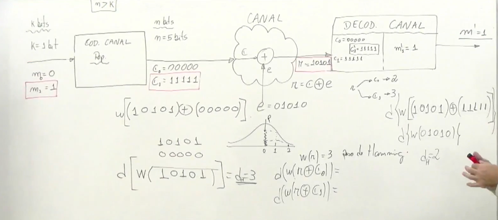

### ***Cálculo do peso e da distância de Hamming*** 

- o peso de Hamming **w(v)** é o numero de elementos não zeros de um vetor, Ou seja, é igual ao numeros de 1s contidos em v.

- a distância de Hamming é a quantidade de 1s que são diferentes entre os dois:  $d(v,x) = w(v \oplus x)$. 
No exemplo da figura a fórmula fica: $d(r,c0) = w(r \oplus c0)$

---

**Notas:**

> N > K para termos reduntâcia na saída do codificador de canal
> 
> Regra para adicionar reduntância: pega a mensagem e repita 4 vezes. Veja C0 e C1 na saída do codificador de canal
>
> No decodificador, após encontrar a menor distância de Hamming, essa será a palavra código transmitida pelo codificador. Porque trabalhamos com probabilidade.
>

---

  

